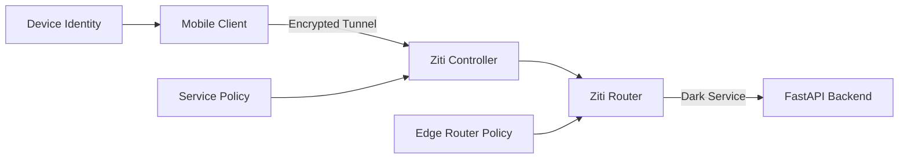

# OpenZiti FastAPI Integration Guide

## Overview

This document provides comprehensive guidance for integrating OpenZiti zero-trust networking with FastAPI applications, specifically optimized for Phase 2 enhancement of mobile AI clients with secure, port-less networking.

## Core OpenZiti Architecture

### Zero-Trust Networking Principles

OpenZiti implements true zero-trust architecture by:
- **Dark Services**: Applications have no open ports and are unreachable from external networks
- **Identity-Based Authentication**: Cryptographic identities replace IP-based security
- **Outbound-Only Connections**: Services establish connections to the Ziti fabric
- **Microsegmentation**: Per-service, per-identity access control policies

### OpenZiti Network Components



## FastAPI Integration Patterns

### Method 1: Monkey Patching (Recommended)

**Why Preferred**: The `@zitify` decorator has known issues with FastAPI response handling.

```python
import openziti
from fastapi import FastAPI
import uvicorn
import os
from typing import Dict, Any

# Configuration-driven networking mode
NETWORKING_MODE = os.getenv("NETWORKING_MODE", "http")  # "http" or "ziti"

app = FastAPI(title="Claude Code API", version="1.0.0")

def setup_ziti_networking():
    """Configure OpenZiti networking if enabled"""
    if NETWORKING_MODE != "ziti":
        print("Running in HTTP mode - no OpenZiti integration")
        return

    # Load Ziti identity and configuration
    identity_file = os.getenv("ZITI_IDENTITY_FILE")
    service_name = os.getenv("ZITI_SERVICE_NAME", "claude-api")

    if not identity_file:
        raise ValueError("ZITI_IDENTITY_FILE environment variable required for ziti mode")

    # OpenZiti configuration
    ziti_config = {
        'ztx': openziti.load(identity_file),
        'service': service_name
    }

    # Apply monkey patching for the binding
    bindings = {('0.0.0.0', 8000): ziti_config}
    openziti.monkeypatch(bindings=bindings)

    print(f"OpenZiti networking enabled for service: {service_name}")

def run_server():
    """Start FastAPI server with optional OpenZiti integration"""
    setup_ziti_networking()

    # Server configuration
    config = {
        "host": "0.0.0.0",
        "port": 8000,
        "log_level": "info"
    }

    if NETWORKING_MODE == "http":
        print("Starting HTTP server on http://0.0.0.0:8000")
    else:
        print("Starting OpenZiti dark service (no open ports)")

    uvicorn.run(app, **config)

if __name__ == "__main__":
    run_server()
```

### Method 2: @zitify Decorator (Known Issues)

```python
# NOT RECOMMENDED: @zitify has response handling issues
import openziti
from fastapi import FastAPI
import uvicorn

app = FastAPI()

@app.get("/")
def read_root():
    return {"Hello": "World"}

# PROBLEM: @zitify doesn't return function results properly
@openziti.zitify(bindings={
    ('0.0.0.0', 8000): {
        'ztx': '/path/to/identity.json',
        'service': 'claude-api'
    }
})
def run_server():
    uvicorn.run(app, host="0.0.0.0", port=8000)

# This will cause FastAPI to not return responses correctly
```

### Environment-Based Configuration

```python
from pydantic import BaseSettings
from typing import Optional

class ZitiSettings(BaseSettings):
    # Networking Configuration
    networking_mode: str = "http"  # "http" or "ziti"

    # OpenZiti Configuration
    ziti_identity_file: Optional[str] = None
    ziti_service_name: str = "claude-api"
    ziti_controller_url: Optional[str] = None

    # Development/Production Settings
    debug_mode: bool = False

    class Config:
        env_file = ".env"

# Usage
settings = ZitiSettings()

def get_ziti_config() -> Optional[Dict]:
    """Get OpenZiti configuration if enabled"""
    if settings.networking_mode != "ziti":
        return None

    if not settings.ziti_identity_file:
        raise ValueError("ZITI_IDENTITY_FILE required for ziti mode")

    return {
        'ztx': openziti.load(settings.ziti_identity_file),
        'service': settings.ziti_service_name
    }
```

## Identity Management

### Ziti Identity Lifecycle

```python
import openziti
from pathlib import Path
import json
from typing import Dict, Optional

class ZitiIdentityManager:
    def __init__(self, identity_dir: str = "./ziti_identities"):
        self.identity_dir = Path(identity_dir)
        self.identity_dir.mkdir(exist_ok=True)
        self.current_identity: Optional[openziti.ZitiContext] = None

    def load_identity(self, identity_file: str) -> openziti.ZitiContext:
        """Load Ziti identity from file"""
        identity_path = Path(identity_file)

        if not identity_path.exists():
            raise FileNotFoundError(f"Identity file not found: {identity_file}")

        try:
            self.current_identity = openziti.load(str(identity_path))
            return self.current_identity
        except Exception as e:
            raise ValueError(f"Failed to load identity: {e}")

    def enroll_identity(self, jwt_token: str, identity_name: str) -> str:
        """Enroll new identity using JWT token"""
        identity_file = self.identity_dir / f"{identity_name}.json"

        try:
            # Enroll identity (placeholder - actual enrollment process)
            identity = openziti.enroll(jwt_token)

            # Save identity to file
            with open(identity_file, 'w') as f:
                json.dump(identity, f, indent=2)

            return str(identity_file)

        except Exception as e:
            raise ValueError(f"Enrollment failed: {e}")

    def validate_identity(self, identity_file: str) -> bool:
        """Validate identity file integrity"""
        try:
            identity = openziti.load(identity_file)
            # Perform basic validation checks
            return identity.is_valid()
        except:
            return False

    def get_identity_info(self, identity_file: str) -> Dict:
        """Get identity information"""
        try:
            identity = openziti.load(identity_file)
            return {
                "name": identity.name,
                "controller": identity.controller_url,
                "expires": identity.expires_at,
                "services": identity.available_services
            }
        except Exception as e:
            return {"error": str(e)}
```

## Service Configuration

### Ziti Service Management

```python
from typing import List, Dict
import requests
import os

class ZitiServiceManager:
    def __init__(self, controller_url: str, admin_token: str):
        self.controller_url = controller_url.rstrip('/')
        self.admin_token = admin_token
        self.headers = {
            'Authorization': f'Bearer {admin_token}',
            'Content-Type': 'application/json'
        }

    def create_service(self, service_name: str,
                      intercept_config: Dict,
                      host_config: Dict) -> Dict:
        """Create Ziti service configuration"""
        service_data = {
            "name": service_name,
            "configs": [intercept_config["id"], host_config["id"]],
            "encryptionRequired": True,
            "roleAttributes": [f"#{service_name}-services"],
            "tags": {
                "type": "api-service",
                "protocol": "https"
            }
        }

        response = requests.post(
            f"{self.controller_url}/services",
            json=service_data,
            headers=self.headers
        )

        return response.json()

    def create_intercept_config(self, name: str, addresses: List[str],
                               ports: List[Dict]) -> Dict:
        """Create intercept configuration for client-side"""
        config_data = {
            "name": f"{name}-intercept",
            "configType": "intercept.v1",
            "data": {
                "addresses": addresses,
                "portRanges": ports,
                "protocols": ["tcp"]
            }
        }

        response = requests.post(
            f"{self.controller_url}/configs",
            json=config_data,
            headers=self.headers
        )

        return response.json()

    def create_host_config(self, name: str, address: str, port: int) -> Dict:
        """Create host configuration for server-side"""
        config_data = {
            "name": f"{name}-host",
            "configType": "host.v1",
            "data": {
                "address": address,
                "port": port,
                "protocol": "tcp"
            }
        }

        response = requests.post(
            f"{self.controller_url}/configs",
            json=config_data,
            headers=self.headers
        )

        return response.json()

# Usage for Claude API service
service_manager = ZitiServiceManager(
    controller_url=os.getenv("ZITI_CONTROLLER_URL"),
    admin_token=os.getenv("ZITI_ADMIN_TOKEN")
)

# Create configurations
intercept_config = service_manager.create_intercept_config(
    name="claude-api",
    addresses=["claude-api.ziti"],
    ports=[{"low": 443, "high": 443}]
)

host_config = service_manager.create_host_config(
    name="claude-api",
    address="localhost",
    port=8000
)

# Create service
claude_service = service_manager.create_service(
    service_name="claude-api",
    intercept_config=intercept_config,
    host_config=host_config
)
```

## iOS Swift Integration

### Ziti URL Protocol Integration

```swift
import Foundation
import CZiti

class ZitiManager: NSObject, ObservableObject {
    @Published var connectionState: ConnectionState = .disconnected
    @Published var enrolledIdentities: [String] = []

    private var zitiContext: ZitiContext?

    enum ConnectionState {
        case disconnected, enrolling, connected, error(String)
    }

    override init() {
        super.init()
        loadStoredIdentities()
    }

    // MARK: - Identity Enrollment
    func enrollIdentity(jwtToken: String, completion: @escaping (Result<String, Error>) -> Void) {
        connectionState = .enrolling

        DispatchQueue.global(qos: .background).async {
            do {
                // Parse JWT to get enrollment information
                let enrollmentInfo = try self.parseJWT(jwtToken)

                // Perform enrollment
                let identity = try ZitiContext.enroll(
                    jwt: jwtToken,
                    keychain: true  // Store in iOS Keychain
                )

                let identityName = enrollmentInfo.name

                DispatchQueue.main.async {
                    self.enrolledIdentities.append(identityName)
                    self.connectionState = .connected
                    completion(.success(identityName))
                }

            } catch {
                DispatchQueue.main.async {
                    self.connectionState = .error(error.localizedDescription)
                    completion(.failure(error))
                }
            }
        }
    }

    // MARK: - Service Connection
    func initializeZitiConnection(identityName: String) throws {
        guard let identity = try loadIdentityFromKeychain(identityName) else {
            throw ZitiError.identityNotFound
        }

        zitiContext = try ZitiContext(identity: identity)

        // Register ZitiUrlProtocol for automatic HTTP interception
        URLProtocol.registerClass(ZitiUrlProtocol.self)

        connectionState = .connected
    }

    // MARK: - HTTP Request Interception
    func configureURLSession() -> URLSession {
        let configuration = URLSessionConfiguration.default

        // Add ZitiUrlProtocol for automatic Ziti routing
        configuration.protocolClasses = [ZitiUrlProtocol.self]

        return URLSession(configuration: configuration)
    }

    private func parseJWT(_ token: String) throws -> EnrollmentInfo {
        // JWT parsing implementation
        let parts = token.components(separatedBy: ".")
        guard parts.count == 3 else {
            throw ZitiError.invalidJWT
        }

        // Decode JWT payload (simplified)
        guard let payloadData = Data(base64Encoded: parts[1]) else {
            throw ZitiError.invalidJWT
        }

        let payload = try JSONDecoder().decode(JWTPayload.self, from: payloadData)
        return EnrollmentInfo(name: payload.sub, controller: payload.iss)
    }

    private func loadIdentityFromKeychain(_ name: String) throws -> ZitiIdentity? {
        // iOS Keychain integration for identity storage
        let query: [String: Any] = [
            kSecClass as String: kSecClassGenericPassword,
            kSecAttrService as String: "ziti-identity",
            kSecAttrAccount as String: name,
            kSecReturnData as String: true
        ]

        var result: CFTypeRef?
        let status = SecItemCopyMatching(query as CFDictionary, &result)

        guard status == errSecSuccess,
              let data = result as? Data else {
            return nil
        }

        return try ZitiIdentity(data: data)
    }

    private func loadStoredIdentities() {
        // Load previously enrolled identities from Keychain
        // Implementation depends on Keychain structure
    }
}

// MARK: - Supporting Types
struct EnrollmentInfo {
    let name: String
    let controller: String
}

struct JWTPayload: Codable {
    let sub: String  // Subject (identity name)
    let iss: String  // Issuer (controller URL)
    let exp: Int     // Expiration
}

enum ZitiError: Error {
    case identityNotFound
    case invalidJWT
    case enrollmentFailed
    case connectionFailed
}
```

### SwiftUI Integration

```swift
import SwiftUI

struct ZitiSettingsView: View {
    @StateObject private var zitiManager = ZitiManager()
    @State private var jwtToken = ""
    @State private var showingEnrollment = false

    var body: some View {
        NavigationView {
            Form {
                Section("Connection Status") {
                    Label {
                        connectionStatusText
                    } icon: {
                        connectionStatusIcon
                    }
                }

                Section("Enrolled Identities") {
                    if zitiManager.enrolledIdentities.isEmpty {
                        Text("No identities enrolled")
                            .foregroundColor(.secondary)
                    } else {
                        ForEach(zitiManager.enrolledIdentities, id: \.self) { identity in
                            Label(identity, systemImage: "person.badge.key")
                        }
                    }

                    Button("Enroll New Identity") {
                        showingEnrollment = true
                    }
                }

                Section("Advanced") {
                    Button("Reset All Identities") {
                        // Reset implementation
                    }
                    .foregroundColor(.red)
                }
            }
            .navigationTitle("Zero Trust Network")
            .sheet(isPresented: $showingEnrollment) {
                EnrollmentView(zitiManager: zitiManager)
            }
        }
    }

    private var connectionStatusText: some View {
        switch zitiManager.connectionState {
        case .disconnected:
            return Text("Disconnected")
        case .enrolling:
            return Text("Enrolling...")
        case .connected:
            return Text("Connected")
        case .error(let message):
            return Text("Error: \(message)")
        }
    }

    private var connectionStatusIcon: some View {
        switch zitiManager.connectionState {
        case .disconnected:
            return Image(systemName: "wifi.slash")
                .foregroundColor(.red)
        case .enrolling:
            return ProgressView()
                .scaleEffect(0.8)
        case .connected:
            return Image(systemName: "checkmark.shield")
                .foregroundColor(.green)
        case .error:
            return Image(systemName: "exclamationmark.triangle")
                .foregroundColor(.orange)
        }
    }
}

struct EnrollmentView: View {
    @ObservedObject var zitiManager: ZitiManager
    @State private var jwtToken = ""
    @Environment(\.dismiss) private var dismiss

    var body: some View {
        NavigationView {
            Form {
                Section("Enrollment Token") {
                    TextEditor(text: $jwtToken)
                        .frame(minHeight: 100)
                        .font(.system(.body, design: .monospaced))

                    Text("Paste the JWT token provided by your administrator")
                        .font(.caption)
                        .foregroundColor(.secondary)
                }

                Section {
                    Button("Enroll Identity") {
                        enrollIdentity()
                    }
                    .disabled(jwtToken.isEmpty)
                }
            }
            .navigationTitle("Enroll Identity")
            .navigationBarTitleDisplayMode(.inline)
            .toolbar {
                ToolbarItem(placement: .cancellationAction) {
                    Button("Cancel") {
                        dismiss()
                    }
                }
            }
        }
    }

    private func enrollIdentity() {
        zitiManager.enrollIdentity(jwtToken: jwtToken) { result in
            switch result {
            case .success:
                dismiss()
            case .failure(let error):
                print("Enrollment failed: \(error)")
                // Show error to user
            }
        }
    }
}
```

## Production Deployment

### Docker Configuration with OpenZiti

```dockerfile
# Multi-stage Dockerfile with OpenZiti support
FROM python:3.11-slim as base

# Install system dependencies
RUN apt-get update && apt-get install -y \
    curl \
    && rm -rf /var/lib/apt/lists/*

WORKDIR /app

# Install Python dependencies
COPY requirements.txt .
RUN pip install --no-cache-dir -r requirements.txt

# Copy application code
COPY . .

FROM base as development
ENV NETWORKING_MODE=http
CMD ["python", "main.py"]

FROM base as production
ENV NETWORKING_MODE=ziti
# Create directory for Ziti identities
RUN mkdir -p /app/ziti_identities
VOLUME ["/app/ziti_identities"]

# Health check that works with both modes
HEALTHCHECK --interval=30s --timeout=10s --start-period=5s --retries=3 \
    CMD python -c "import requests; requests.get('http://localhost:8000/health')" || exit 1

CMD ["python", "main.py"]
```

### Docker Compose with OpenZiti

```yaml
version: '3.8'

services:
  claude-api-http:
    build:
      context: .
      target: development
    ports:
      - "8000:8000"
    environment:
      - NETWORKING_MODE=http
      - CLAUDE_API_KEY=${CLAUDE_API_KEY}
    profiles:
      - http

  claude-api-ziti:
    build:
      context: .
      target: production
    volumes:
      - ./ziti_identities:/app/ziti_identities:ro
    environment:
      - NETWORKING_MODE=ziti
      - ZITI_IDENTITY_FILE=/app/ziti_identities/claude-api.json
      - ZITI_SERVICE_NAME=claude-api
      - CLAUDE_API_KEY=${CLAUDE_API_KEY}
    profiles:
      - ziti

  # Optional: Ziti Controller for self-hosted deployments
  ziti-controller:
    image: openziti/ziti-controller:latest
    ports:
      - "8440:8440"  # Management API
      - "8441:8441"  # Edge Client API
      - "8442:8442"  # Edge Router API
    volumes:
      - ziti-controller-data:/openziti
    environment:
      - ZITI_CONTROLLER_RAWNAME=ziti-controller
      - ZITI_USER=admin
      - ZITI_PWD=${ZITI_ADMIN_PASSWORD:-admin}
    profiles:
      - self-hosted

volumes:
  ziti-controller-data:
```

## Deployment Script

```bash
#!/bin/bash
# deploy-ziti.sh - OpenZiti deployment automation

set -e

NETWORKING_MODE=${NETWORKING_MODE:-http}
ENVIRONMENT=${ENVIRONMENT:-development}

echo "Deploying Claude API with networking mode: $NETWORKING_MODE"

if [ "$NETWORKING_MODE" = "ziti" ]; then
    # Validate Ziti configuration
    if [ -z "$ZITI_IDENTITY_FILE" ]; then
        echo "ERROR: ZITI_IDENTITY_FILE environment variable required for ziti mode"
        exit 1
    fi

    if [ ! -f "$ZITI_IDENTITY_FILE" ]; then
        echo "ERROR: Ziti identity file not found: $ZITI_IDENTITY_FILE"
        exit 1
    fi

    echo "Using Ziti identity: $ZITI_IDENTITY_FILE"

    # Deploy with Ziti profile
    docker-compose --profile ziti up -d

    echo "Claude API deployed as Ziti dark service"
    echo "No open ports - accessible only through Ziti network"

else
    # Deploy with HTTP profile
    docker-compose --profile http up -d

    echo "Claude API deployed with HTTP networking"
    echo "Accessible at: http://localhost:8000"
fi

# Health check
echo "Waiting for service to start..."
sleep 10

if [ "$NETWORKING_MODE" = "http" ]; then
    curl -f http://localhost:8000/health || {
        echo "Health check failed"
        exit 1
    }
    echo "Service health check passed"
else
    echo "Ziti service deployed - health check via Ziti network required"
fi

echo "Deployment complete!"
```

## Best Practices Summary

1. **Use monkey patching** instead of @zitify decorator for FastAPI
2. **Store identities securely** in iOS Keychain or secure file storage
3. **Implement proper error handling** for enrollment and connection failures
4. **Use environment variables** for configuration management
5. **Validate identity files** before attempting to load them
6. **Implement graceful fallbacks** to HTTP mode when Ziti unavailable
7. **Use proper service configurations** with appropriate policies
8. **Monitor service health** even with dark services
9. **Document enrollment process** for end users
10. **Test both networking modes** in development and production

## Common Pitfalls to Avoid

- Don't use @zitify decorator with FastAPI - response handling issues
- Don't store identities in plaintext - use secure storage
- Don't skip identity validation - leads to runtime errors
- Don't ignore enrollment failures - implement proper user feedback
- Don't hardcode service names - use environment configuration
- Don't skip health checks - important for service monitoring
- Don't forget iOS Keychain permissions for identity storage
- Don't skip ZitiUrlProtocol registration - breaks automatic routing

This comprehensive guide provides all necessary patterns for implementing OpenZiti zero-trust networking with FastAPI and iOS Swift applications.