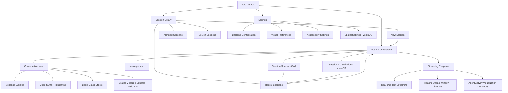
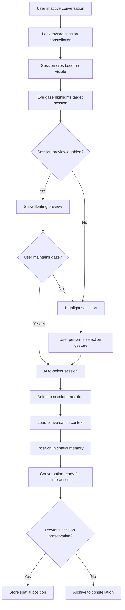

# VisionForge UI/UX Specification

## Introduction

This document defines the user experience goals, information architecture, user flows, and visual design specifications for VisionForge's user interface. It serves as the foundation for visual design and frontend development, ensuring a cohesive and user-centered experience across both the current iPad implementation and the planned visionOS spatial computing interface.

VisionForge is a SwiftUI Claude Code client that transforms mobile AI-assisted development workflows through innovative spatial computing interactions while maintaining the powerful conversation management and real-time streaming capabilities that make it essential for developer productivity.

## Overall UX Goals & Principles

### Target User Personas

**Developer Power Users:** Professional software developers and technical architects who use Claude Code for complex problem-solving, code review, and architectural discussions. They value efficiency, context preservation, and the ability to manage multiple concurrent conversations while maintaining flow state during deep development work.

**AI-Assisted Coders:** Developers embracing vibe coding and agentic coding workflows who need intuitive interfaces for rapid iteration, natural language interaction with AI agents, and seamless transitions between conversational exploration and autonomous task execution.

**Early Spatial Computing Adopters:** Forward-thinking developers with Apple Vision Pro devices who seek cutting-edge development tools that leverage spatial computing for enhanced productivity, contextual awareness, and immersive collaboration experiences.

### Usability Goals

- **Conversation Flow Preservation:** Developers can maintain uninterrupted dialogue with Claude across session switches, device transitions, and spatial context changes
- **Real-time Responsiveness:** All streaming interactions complete within 200ms response time with smooth 60fps visual feedback
- **Context Switching Efficiency:** Users can switch between multiple Claude conversations with zero cognitive overhead using spatial memory patterns
- **Spatial Interaction Intuitiveness:** VisionOS users can master eye gaze, gesture, and voice interactions within their first 5-minute session
- **Cross-Platform Consistency:** Developers experience identical conversation quality whether using iPad, macOS, or visionOS interfaces

### Design Principles

1. **Conversation-Centric Design** - Every interface decision prioritizes preserving and enhancing AI conversation quality over visual novelty
2. **Spatial-Ready Architecture** - Design patterns scale gracefully from 2D touch interactions to 3D spatial computing without breaking user mental models
3. **Performance-First Aesthetics** - Visual effects enhance functionality and never compromise real-time streaming or interaction responsiveness
4. **Progressive Spatial Enhancement** - Advanced spatial features provide value-add experiences while maintaining full functionality in traditional interfaces
5. **Developer Workflow Integration** - Interface patterns align with established development tool conventions while introducing spatial computing benefits

### Change Log

| Date | Version | Description | Author |
|------|---------|-------------|---------|
| 2025-09-16 | 1.0 | Initial UI/UX specification creation | Sally (UX Expert) |

## Information Architecture (IA)

### Site Map / Screen Inventory



### Navigation Structure

**Primary Navigation:**
- **iPad**: NavigationSplitView with persistent sidebar showing session list and main conversation area
- **visionOS**: Spatial session constellation with eye-gaze selection and floating conversation windows

**Secondary Navigation:**
- **Within Conversations**: Message history scrolling (iPad) or spatial depth browsing (visionOS)
- **Session Management**: Search, filter, and archive actions available in both session sidebar and spatial constellation
- **Settings Access**: Standard gear icon on iPad, spatial settings orb on visionOS

**Breadcrumb Strategy:**
- **iPad**: Traditional navigation bar with session title and back navigation
- **visionOS**: Spatial context preservation through persistent session positioning and visual depth cues
- **Cross-Platform**: Session titles and timestamps provide consistent orientation regardless of interface

## User Flows

### New Claude Conversation Flow

**User Goal:** Start a new AI conversation for coding assistance, debugging, or architectural discussion

**Entry Points:**
- App launch with no active sessions
- "New Session" button from session library
- Quick action from spatial constellation (visionOS)

**Success Criteria:** User successfully initiates conversation and receives first Claude response within 200ms

#### Flow Diagram

```mermaid
graph TD
    A[User opens VisionForge] --> B{Active sessions exist?}
    B -->|No| C[Show session library]
    B -->|Yes| D[Show last active conversation]

    C --> E[Tap "New Session"]
    D --> F[Access session sidebar/constellation]
    F --> E

    E --> G[Backend connection check]
    G -->|Connected| H[Create new session]
    G -->|Failed| I[Show connection error]
    I --> J[Retry connection]
    J --> G

    H --> K[Show conversation interface]
    K --> L[User types first message]
    L --> M[Send to Claude API]
    M --> N[Stream response in real-time]
    N --> O[Conversation established]

    O --> P{Platform?}
    P -->|iPad| Q[Traditional message bubbles]
    P -->|visionOS| R[Spatial conversation spheres]
```

#### Edge Cases & Error Handling:
- Network disconnection during session creation → Retry with offline queue
- Backend service unavailable → Clear error message with manual retry option
- Claude API rate limiting → Progressive backoff with user notification
- Session creation timeout → Fallback to cached session list

**Notes:** Flow prioritizes immediate feedback and graceful error recovery, essential for developer workflow continuity

### Spatial Session Switching (visionOS)

**User Goal:** Switch between multiple concurrent Claude conversations using spatial interface

**Entry Points:**
- Eye gaze toward session constellation
- Hand gesture while in active conversation
- Voice command "Show sessions"

**Success Criteria:** User switches to desired conversation context within 3 seconds with zero context loss

#### Flow Diagram



#### Edge Cases & Error Handling:
- Session failed to load → Show cached messages with sync notification
- Spatial tracking lost → Fallback to traditional session list
- Multiple sessions selected simultaneously → Priority selection based on gaze duration
- Memory pressure → Intelligent session hibernation with visual cues

**Notes:** Flow leverages spatial memory patterns to reduce cognitive load during context switching

## Wireframes & Mockups

**Primary Design Files:** Design files will be created in Figma with separate artboards for iPad and visionOS interfaces. The Figma workspace will include interactive prototypes demonstrating spatial interactions and transition animations.

- **Figma Workspace:** [VisionForge UI/UX Design System](https://figma.com/visionforge-design-system) *(to be created)*
- **iPad Artboards:** Current production interface documentation and enhancement mockups
- **visionOS Artboards:** Spatial interface concepts, depth relationship studies, and interaction prototypes

### Key Screen Layouts

#### Main Conversation Interface (iPad)

**Purpose:** Primary interface for AI conversation with Claude, optimized for touch interaction and horizontal screen orientation

**Key Elements:**
- NavigationSplitView with persistent session sidebar (30% width)
- Main conversation area with liquid glass message bubbles
- Real-time streaming text with AttributedString optimization
- Floating input field with voice-to-text integration
- Session management controls (new, search, archive)

**Interaction Notes:** Touch-based message selection, swipe gestures for session switching, pressure-sensitive liquid glass effects responding to touch intensity

**Design File Reference:** `iPad/Main-Conversation-Interface.fig`

#### Spatial Conversation Volume (visionOS)

**Purpose:** Immersive 3D conversation interface leveraging spatial computing for enhanced developer workflows

**Key Elements:**
- Floating conversation spheres with depth-based message hierarchy
- Eye-gaze responsive message highlighting and expansion
- Spatial session constellation visible in peripheral vision
- Hand gesture controls for message manipulation and agent interaction
- Floating streaming windows that follow user attention

**Interaction Notes:** Eye tracking for focus, hand gestures for selection and manipulation, voice input for message composition, spatial memory for session positioning

**Design File Reference:** `visionOS/Spatial-Conversation-Volume.fig`

#### Session Management Hub (Cross-Platform)

**Purpose:** Unified session organization interface adapted for each platform's interaction paradigms

**Key Elements:**
- Session search and filtering capabilities
- Visual conversation thumbnails with preview text
- Session archival and organization tools
- Backend connection status and configuration access
- Performance metrics and usage analytics

**Interaction Notes:**
- **iPad:** Traditional list interface with swipe actions and search bar
- **visionOS:** 3D constellation with spatial search and gesture-based organization

**Design File Reference:** `Cross-Platform/Session-Management-Hub.fig`

## Component Library / Design System

**Design System Approach:** VisionForge will establish a unified design system called "Liquid Spatial" that extends iOS 26 Liquid Glass design principles into spatial computing contexts. The system will maintain visual consistency while embracing platform-specific interaction paradigms. Components will be architected with progressive enhancement - working beautifully on iPad while gaining spatial superpowers on visionOS.

### Core Components

#### Conversation Bubble

**Purpose:** Primary container for Claude responses and user messages, serving as the foundation for all AI conversation interfaces

**Variants:**
- **Standard Bubble (iPad):** Traditional rounded rectangle with liquid glass background and pressure-responsive effects
- **Spatial Sphere (visionOS):** Floating 3D conversation sphere with depth-based positioning and eye-gaze responsiveness
- **Streaming Bubble:** Animated variant that displays real-time text streaming with optimized AttributedString rendering
- **Code Block Bubble:** Specialized variant with syntax highlighting and copy-to-clipboard functionality

**States:** Default, Focused, Streaming, Selected, Expanded, Error, Loading

**Usage Guidelines:** Always maintain 60fps performance during transitions. Ensure accessibility compliance with VoiceOver and spatial accessibility features. Preserve conversation context through bubble positioning and visual hierarchy.

#### Session Orb

**Purpose:** Represents individual Claude conversations in both traditional list and spatial constellation layouts

**Variants:**
- **List Item (iPad):** Traditional table cell with conversation preview, timestamp, and swipe actions
- **Spatial Orb (visionOS):** 3D floating sphere with conversation topic visualization and proximity-based information display
- **Mini Orb:** Compact version for constellation overview states
- **Active Orb:** Highlighted variant indicating current conversation

**States:** Inactive, Highlighted, Active, Loading, Syncing, Archived

**Usage Guidelines:** Session orbs should provide immediate context about conversation topic through visual cues. Spatial orbs must maintain consistent positioning to leverage spatial memory. Always include accessibility labels for screen readers.

#### Streaming Window

**Purpose:** Displays real-time Claude responses with optimized performance for continuous text updates

**Variants:**
- **Inline Stream (iPad):** Embedded streaming text within conversation bubbles
- **Floating Window (visionOS):** Eye-gaze following window that maintains optimal reading distance and angle
- **Picture-in-Picture Stream:** Compact streaming display for multi-conversation scenarios
- **Agent Activity Stream:** Specialized variant showing autonomous agent progress and decision-making

**States:** Idle, Streaming, Paused, Complete, Error, Reconnecting

**Usage Guidelines:** Streaming must never drop below 200ms response time. Windows should follow accessibility guidelines for motion reduction. Spatial windows must respect user comfort zones and avoid motion sickness.

#### Navigation Constellation

**Purpose:** Spatial navigation system that replaces traditional menus and sidebars in visionOS environments

**Variants:**
- **Session Constellation:** Circular arrangement of session orbs around user
- **Settings Constellation:** Floating configuration interface with gesture-based controls
- **Tool Constellation:** Quick access to Claude Code tools and features
- **Collapsed Constellation:** Minimized state showing only essential navigation points

**States:** Expanded, Collapsed, Transitioning, Hidden, Configuration Mode

**Usage Guidelines:** Constellations should maintain consistent spatial relationships to build user muscle memory. Eye-gaze interaction must feel natural and responsive. Always provide traditional navigation fallbacks for accessibility.

## Branding & Style Guide

### Visual Identity

**Brand Guidelines:** VisionForge follows the "Liquid Spatial" design philosophy that extends iOS 26 Liquid Glass principles into spatial computing contexts. The brand emphasizes technological sophistication balanced with approachable developer-focused functionality. Visual treatments should feel premium yet practical, innovative yet familiar.

### Color Palette

| Color Type | Hex Code | Usage |
|------------|----------|-------|
| Primary | #007AFF | Claude interaction elements, active states, primary actions |
| Secondary | #5856D6 | Spatial computing highlights, visionOS-specific features |
| Accent | #FF9500 | Streaming indicators, real-time feedback, attention states |
| Success | #34C759 | Connection status, successful operations, completion states |
| Warning | #FF9500 | Network issues, performance warnings, important notices |
| Error | #FF3B30 | Connection failures, critical errors, destructive actions |
| Neutral | #8E8E93, #AEAEB2, #C7C7CC, #D1D1D6, #E5E5EA, #F2F2F7 | Text hierarchy, borders, backgrounds, spatial depth cues |

### Typography

#### Font Families
- **Primary:** SF Pro (system font for optimal performance and platform integration)
- **Secondary:** SF Compact (space-efficient variant for session lists and metadata)
- **Monospace:** SF Mono (code display, technical content, developer-focused interfaces)

#### Type Scale

| Element | Size | Weight | Line Height |
|---------|------|--------|-------------|
| H1 | 34pt | Bold | 41pt |
| H2 | 28pt | Bold | 34pt |
| H3 | 22pt | Semibold | 28pt |
| Body | 17pt | Regular | 22pt |
| Small | 15pt | Regular | 20pt |

### Iconography

**Icon Library:** SF Symbols with custom spatial computing extensions for visionOS-specific features

**Usage Guidelines:**
- Use SF Symbols for consistency with Apple platform conventions
- Create custom icons only for VisionForge-specific spatial features (conversation spheres, session constellations)
- Maintain consistent visual weight and style across all icons
- Ensure icons work in both 2D and spatial contexts with appropriate depth treatment

### Spacing & Layout

**Grid System:**
- **iPad:** 8pt base grid with 16pt, 24pt, and 32pt increments for layout structure
- **visionOS:** Spatial grid based on comfortable viewing distances (0.5m, 1m, 2m zones) with depth-based scaling

**Spacing Scale:** 4pt, 8pt, 16pt, 24pt, 32pt, 48pt, 64pt (powers of 2 for mathematical precision and visual harmony)

## Accessibility Requirements

### Compliance Target

**Standard:** WCAG 2.1 AA compliance with enhanced spatial computing accessibility guidelines for visionOS experiences. VisionForge will exceed baseline requirements by implementing cutting-edge spatial accessibility features that make AI conversation interfaces truly inclusive.

### Key Requirements

**Visual:**
- Color contrast ratios: Minimum 4.5:1 for normal text, 3:1 for large text, with spatial depth adjustments maintaining contrast in 3D environments
- Focus indicators: High-contrast focus rings on iPad with spatial glow effects on visionOS that respect user comfort zones
- Text sizing: Support for Dynamic Type up to AX5 size categories with spatial scaling that maintains readability at comfortable viewing distances

**Interaction:**
- Keyboard navigation: Full app functionality accessible via keyboard shortcuts and external keyboard support on iPad
- Screen reader support: VoiceOver compatibility with spatial audio cues for visionOS conversation positioning and depth relationships
- Touch targets: Minimum 44pt touch targets on iPad, spatial targets minimum 0.5m comfortable interaction zones on visionOS

**Content:**
- Alternative text: Comprehensive alt text for all visual elements including spatial positioning descriptions for screen readers
- Heading structure: Logical heading hierarchy that translates to spatial information architecture in 3D environments
- Form labels: Clear, descriptive labels for all input fields with spatial context information for visionOS voice input

### Testing Strategy

**Automated Testing:** Integration with Xcode Accessibility Inspector and custom spatial accessibility validation tools for visionOS. Continuous accessibility testing in CI/CD pipeline with automated contrast checking and VoiceOver navigation verification.

**Manual Testing:** Regular testing with actual assistive technology users, including blind developers and users with motor disabilities. Spatial accessibility testing with Vision Pro accessibility features including eye tracking alternatives and voice control.

**Performance Testing:** Accessibility features must maintain 60fps performance and 200ms response times. Spatial accessibility interactions must not introduce motion sickness or discomfort.

## Responsiveness Strategy

### Breakpoints

| Breakpoint | Min Width | Max Width | Target Devices |
|------------|----------|-----------|----------------|
| Mobile | 320px | 767px | iPhone SE, iPhone 15 (portrait/landscape) |
| Tablet | 768px | 1023px | iPad, iPad Air (portrait), iPad Pro 11" (portrait) |
| Desktop | 1024px | 1439px | iPad Pro 12.9", MacBook displays, external monitors |
| Wide | 1440px | - | Studio Display, Pro Display XDR, ultra-wide monitors |

### Adaptation Patterns

**Layout Changes:**
- **Mobile**: Single-column conversation view with bottom sheet session picker, optimized for thumb navigation
- **Tablet**: NavigationSplitView with collapsible sidebar (30% width), conversation area adapts to reading distance
- **Desktop**: Full NavigationSplitView with fixed sidebar, multi-conversation preview capabilities
- **visionOS**: Spatial breakpoints based on comfortable viewing zones (0.5m intimate, 1m personal, 2m social distances)

**Navigation Changes:**
- **Mobile**: Tab bar navigation with conversation overflow in modal sheets
- **Tablet**: Persistent sidebar with session list, swipe gestures for quick switching
- **Desktop**: Full sidebar with session search, keyboard shortcuts for power users
- **visionOS**: Spatial constellation navigation with eye-gaze and gesture controls

**Content Priority:**
- **Mobile**: Conversation focus with session context on-demand
- **Tablet**: Balanced conversation and session overview
- **Desktop**: Multi-session awareness with conversation details
- **visionOS**: Immersive conversation with peripheral session awareness

**Interaction Changes:**
- **Mobile**: Touch-optimized with haptic feedback, voice input for long messages
- **Tablet**: Touch with Apple Pencil support, pressure-sensitive liquid glass effects
- **Desktop**: Mouse/trackpad with keyboard shortcuts, external keyboard optimization
- **visionOS**: Eye tracking + hand gestures + voice input, spatial manipulation

## Animation & Micro-interactions

### Motion Principles

**Performance-First Motion:** All animations must maintain 60fps performance and never interfere with real-time Claude streaming. Motion serves functionality - providing feedback, guiding attention, and preserving spatial context - rather than decoration.

**Spatial-Aware Animation:** Animations scale gracefully from 2D touch interfaces to 3D spatial computing, with depth-based timing and spatial relationship preservation. Motion respects user comfort zones and accessibility preferences including reduced motion settings.

**Developer-Focused Feedback:** Animation language emphasizes immediate response, clear state changes, and progress indication that developers expect from professional tools. Motion enhances productivity rather than distracting from coding workflows.

### Key Animations

- **Message Bubble Appearance:** Gentle scale and fade-in with liquid glass ripple effect (Duration: 300ms, Easing: ease-out-quart)
- **Real-time Streaming Indicator:** Pulsing dot with liquid flow animation showing Claude thinking state (Duration: 1.2s loop, Easing: ease-in-out-sine)
- **Session Transition:** Smooth slide transition with momentum preservation for session switching (Duration: 250ms, Easing: ease-out-cubic)
- **Spatial Constellation Reveal:** Eye-gaze triggered expansion of session orbs with depth-based stagger (Duration: 400ms, Easing: ease-out-back)
- **Conversation Sphere Float:** Subtle floating motion for spatial message spheres maintaining comfortable viewing (Duration: 4s loop, Easing: ease-in-out-sine)
- **Liquid Glass Ripple:** Pressure-responsive ripple effect spreading from touch point with momentum physics (Duration: 600ms, Easing: ease-out-quart)
- **Streaming Text Reveal:** Character-by-character reveal with subtle glow effect for real-time responses (Duration: per-character timing, Easing: linear)
- **Agent Activity Visualization:** Particle system showing autonomous agent work with organic movement patterns (Duration: continuous, Easing: ease-in-out-quad)

## Performance Considerations

### Performance Goals

- **Page Load:** Initial app launch under 2 seconds on iPad Pro M1+, conversation interface ready within 1 second
- **Interaction Response:** All user interactions respond within 16ms (60fps), Claude streaming responses begin within 200ms
- **Animation FPS:** Maintain 60fps for all animations and transitions, degrade gracefully under memory pressure while preserving core functionality

### Design Strategies

**SwiftUI Optimization:** Leverage SwiftUI's built-in performance optimizations including view identity management, lazy loading, and efficient state updates. Use AttributedString caching for streaming text to minimize repeated rendering calculations. Implement conversation view recycling to handle large message histories without memory bloat.

**Spatial Computing Performance:** visionOS interfaces must maintain 90Hz refresh rates for comfortable spatial experiences. Spatial animations use efficient depth calculations and GPU-accelerated rendering. Conversation spheres implement level-of-detail rendering based on viewing distance to optimize performance.

**Real-time Streaming Optimization:** Claude response streaming uses optimized text rendering pipelines that don't block UI thread. Background processing handles AttributedString formatting while main thread focuses on smooth display updates. Intelligent text chunking prevents UI freezes during long responses.

**Memory Management:** Implement conversation hibernation for inactive sessions to manage memory pressure. Use lazy loading for conversation history and intelligent image/code block caching. visionOS spatial elements use efficient 3D rendering techniques and automatic cleanup of off-screen content.

**Battery Efficiency:** Liquid glass effects use GPU-accelerated Core Animation for energy efficiency. Spatial computing features include battery-aware performance scaling. Background conversation syncing uses efficient networking patterns that respect system energy management.
